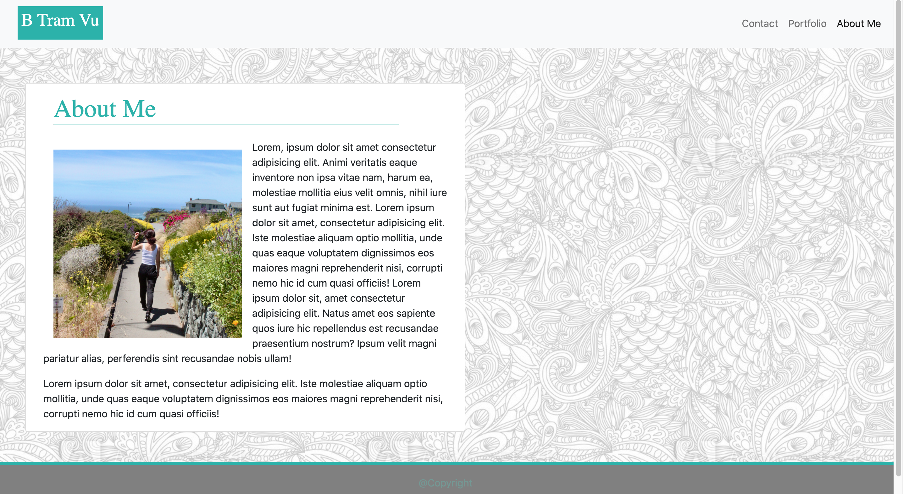
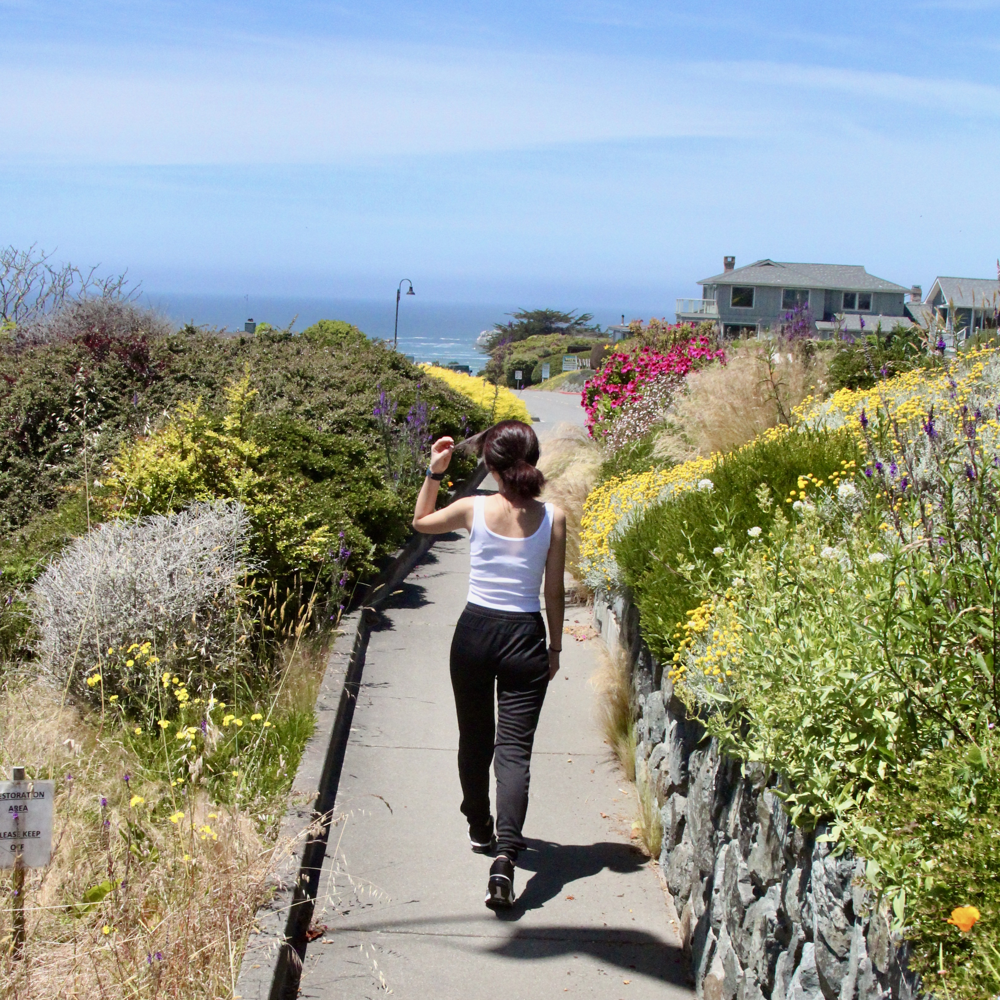

# Responsive Portfolio 

This profect focused on building a responsive website that creates dynamic changes to the apprearance of the portfolite website depending on the devices' size. Using Bootstrap as the main tool to deliver responsive nav bar, images, texts, and layout. 

## Site Picture


# Table of contents 
[Tittle](#Responsive-portfolio)

[Site Picutre](#Site-picture)

[Description of Page Building ](#Description-of-Page-Building )

[Code Snippet](#Code-Snippet)

[Technologies Used](#Technologies-Used)

[Deployed Link](#Deployed-Link)

[Author](#Author)

[License](#License)

## Description of Page Building 
 * Add starter template from Bootstrap
 * Construct a semantic layout
 * Add nav bar
 * Insert functional links to nav bar
 * Add container
 * Create card with grid system for more structure layouts 
 * Add values to row and collums for responisveness base on screen's sizes
 * Link pages porperly in heading such as meta tags, Google font link, and css file 
 * Add css file to add more styling 
 * Style content with css using Google Font, opacity, and background image
 * Add a set of useful information about the project in Readme file 
 
  


## Code Snippet
Add responsive nav bar
```html
<nav class="navbar navbar-expand-lg navbar-light bg-light">
    <div class="navbar-nav">
        <a class="nav-link" href="./contact.html">Contact</a>
        <a class="nav-link" href="./portfolio.html">Portfolio</a>
        <a class="nav-link active" aria-current="page" href="./index.html">About Me</a>
    </div>
</nav>
```
Add a container surrounding the content and add card for better structure 
```html
<div class="container ">
  <!-- adding card  -->
  <div class="card mb-5" style ="margin-top: 2rem; max-width: 700px;">
```
Use grid system to divide content into smaller sections to define the relationship between layer, position, and mobile friendly
```html
<header class="row" style="margin-left:1rem; margin-right: 1rem;">
    <h1> About Me</h1>
</header>
      
<div class="row" style="margin-left:1rem; margin-right: 1rem;">
    <!-- column 1 for content with img -->
    <div class="col-md-12">
    
    <p>Lorem</p>
    </div>
    <!-- column 2 for second paragraph -->
    <div class="col-md-12">
    <p>Lorem </p>
    </div>        
</div>
```
Style using css 
```html
 header {
    color: #20B2AA;
    padding: 1rem;
    font-family: 'Playfair Display', serif;
 }
 #Copyright {
  opacity: 0.3;
 }
```
    

## Technologies Used
- HTML - used to create elements on the DOM
  * [HTML](https://developer.mozilla.org/en-US/docs/Web/HTML)
- CSS - styles html elements on page
  * [CSS](https://developer.mozilla.org/en-US/docs/Web/CSS)
- Bootstrap - design and customize responsive site
  * [Bootstrap](https://getbootstrap.com/)
- Git - version control system to track changes to source code
   * [Git](https://git-scm.com/)
- GitHub - hosts repository that can be deployed to GitHub Pages
  * [Github](https://github.com/)
  


## Deployed Link

* [See Live Site](https://vubao2303.github.io/responsive-portfolio/)


## Author

* **B Tram Vu** 

- [Link to Portfolio Site](#)
- [Link to Github](https://github.com/vubao2303/responsive-portfolio)
- [Link to LinkedIn](https://www.linkedin.com/in/tram-vu-866250121/)


## License

This project is licensed under the Trilogy Education Services, a 2U, Inc. brand.
